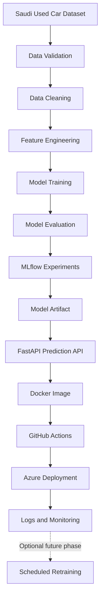
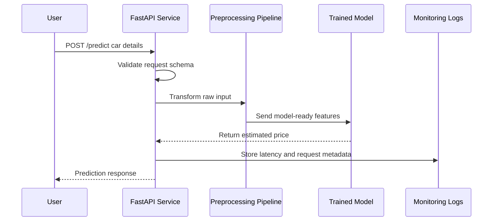
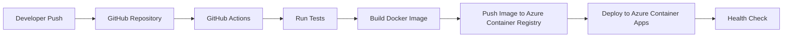

# SaudiCar AI

Zero to Hero MLOps Bootcamp: build and deploy a production-style machine learning system for predicting used car prices in Saudi Arabia.

## Project Goal

SaudiCar AI is a 30-day, hands-on MLOps bootcamp project. The goal is not only to train a machine learning model, but to understand how a model becomes a real software product: cleaned data, repeatable training, experiment tracking, an API, Docker packaging, CI/CD, cloud deployment, and monitoring.

The first version uses an existing Saudi used car dataset from Kaggle. Later versions may extend the system with new marketplace listings and automatic retraining, only if the data source is legally and technically appropriate.

## What You Will Build

By the end of the bootcamp, this repository should contain:

- A clean Python ML project structure.
- Data cleaning and feature engineering pipelines.
- A trained car price prediction model.
- MLflow experiment tracking.
- A FastAPI prediction service.
- Docker packaging.
- GitHub Actions CI/CD.
- Azure deployment.
- API health checks, logs, and basic monitoring.
- Interview-ready documentation and architecture diagrams.

## Target Architecture



## API Request Flow



## CI/CD Flow



## Technology Stack

| Area | Tools |
| --- | --- |
| Language | Python |
| Data | Pandas, NumPy |
| Machine Learning | Scikit-learn |
| Experiment Tracking | MLflow |
| API | FastAPI, Pydantic, Uvicorn |
| Packaging | Docker |
| Version Control | Git, GitHub |
| CI/CD | GitHub Actions |
| Cloud | Azure Container Registry, Azure Container Apps or App Service |
| Monitoring | Application logs, health checks, latency/error tracking |

## 30-Day Roadmap

| Week | Theme | Outcome |
| --- | --- | --- |
| Week 1 | ML Foundations | A working baseline model trained on Saudi used car data. |
| Week 2 | ML Engineering | A professional Python project with reusable scripts and a FastAPI service. |
| Week 3 | Core MLOps | Dockerized app, MLflow tracking, model comparison, and basic tests. |
| Week 4 | Production Delivery | CI/CD pipeline, Azure deployment, monitoring, README, and interview demo. |

For the full daily plan, see [docs/BOOTCAMP_PLAN.md](docs/BOOTCAMP_PLAN.md).

For local setup commands, see [docs/DAY_01_SETUP.md](docs/DAY_01_SETUP.md).

For dataset details, see [docs/DATASET.md](docs/DATASET.md).

For the first exploratory analysis, see [docs/EDA_SUMMARY.md](docs/EDA_SUMMARY.md).

## Expected Repository Structure

```text
.
|-- data/
|   |-- raw/
|   |-- processed/
|-- docs/
|   |-- BOOTCAMP_PLAN.md
|-- models/
|-- notebooks/
|-- src/
|   |-- saudi_car_ai/
|   |   |-- api/
|   |   |-- data/
|   |   |-- features/
|   |   |-- models/
|   |   |-- monitoring/
|-- tests/
|-- .github/
|   |-- workflows/
|-- Dockerfile
|-- docker-compose.yml
|-- pyproject.toml
|-- README.md
```

## Learning Philosophy

This bootcamp is designed around one rule: every tool must solve a real problem in the project.

- 80 percent coding, 20 percent theory.
- Beginner-friendly MLOps explanations.
- English-first teaching, with Arabic support when needed.
- Small quizzes only.
- No homework.
- Debugging is part of the lesson.
- The student should struggle briefly before receiving help.
- Every week produces a visible project milestone.

## Portfolio Outcome

At the end of the bootcamp, the student should be able to open this repository and explain:

- Where the data came from.
- How the data was cleaned.
- Which features were used.
- Which models were tested.
- Why the final model was selected.
- How MLflow tracks experiments.
- How the FastAPI service returns predictions.
- How Docker packages the application.
- How GitHub Actions automates testing and deployment.
- How the model is deployed on Azure.
- What should be monitored after deployment.
- What future improvements would make the system more production-grade.

## Optional Future Extensions

These are intentionally outside the core 30-day scope:

- Marketplace scraping, if permitted by the source terms.
- Scheduled retraining.
- Model drift detection.
- Prediction history database.
- Authentication.
- Admin dashboard.
- Terraform infrastructure.
- Kubernetes deployment.
- Feature store.

## Project Status

Day 1 setup phase. The Kaggle dataset has been selected and loaded locally. The next step is to start exploratory data analysis.
