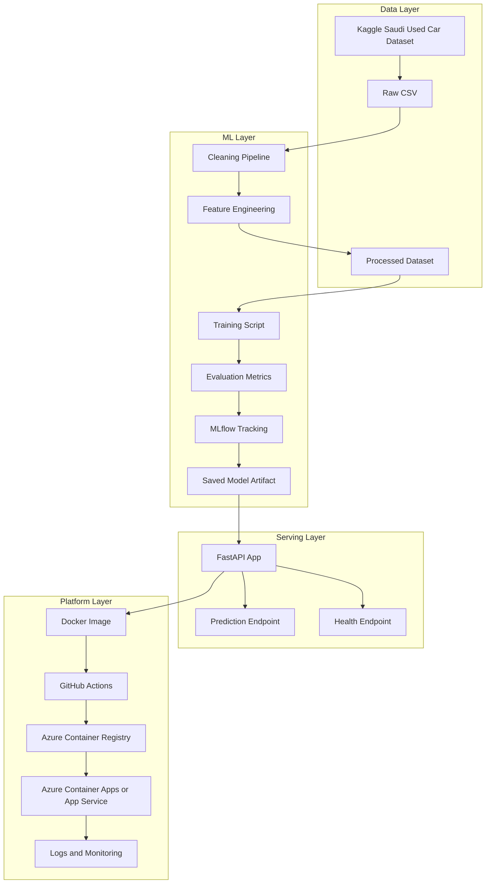
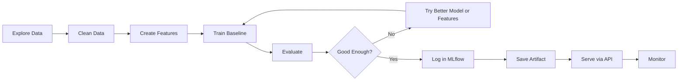

# SaudiCar AI Bootcamp Plan

This document turns the SaudiCar AI idea into a clear 30-day delivery plan. It is designed for a beginner who knows some Python but has little or no MLOps experience.

## North Star

Build a production-style machine learning API that predicts used car prices in Saudi Arabia and can be explained confidently in an ML Engineer or MLOps interview.

## Scope Decision

The core bootcamp should build a strong MVP, not a huge enterprise platform.

Core scope:

- Use an existing Kaggle dataset.
- Clean and prepare the data.
- Train and evaluate models.
- Track experiments with MLflow.
- Serve predictions with FastAPI.
- Package the API with Docker.
- Deploy to Azure.
- Add basic CI/CD and monitoring.

Out of scope for the first 30 days:

- Full web app frontend.
- Complex scraping.
- Kubernetes.
- Terraform.
- Advanced feature stores.
- Advanced drift detection.
- Fully automated retraining.

These can become bonus modules after the student has a working deployed system.

## System Architecture



## Model Lifecycle



## Teaching Rhythm

Each lesson should follow this structure:

1. Define the practical problem for the day.
2. Explain only the minimum theory needed.
3. Build the feature or workflow.
4. Run it and break it intentionally when useful.
5. Debug together.
6. Review what was built and why it matters.
7. Connect the day to the final architecture.

The mentor should not immediately rescue the student. Let the student struggle for about five minutes when debugging, then guide with hints before giving the full fix.

## Weekly Milestones

| Week | Theme | End-of-Week Demo |
| --- | --- | --- |
| 1 | Machine Learning Foundations | Run a notebook or script that trains a baseline car price model and prints metrics. |
| 2 | ML Engineering | Run a clean FastAPI service locally and get a prediction from saved model artifacts. |
| 3 | Core MLOps | Build and run the Docker container, compare MLflow runs, and execute basic tests. |
| 4 | Production Delivery | Push to GitHub, trigger CI/CD, deploy to Azure, and present the final repository. |

## 30-Day Plan

| Day | Focus | Build Output |
| --- | --- | --- |
| 1 | Bootcamp setup and project story | Create repo, environment, folder structure, and first README draft. |
| 2 | Python for ML refresh | Practice functions, files, virtual environments, and package installation. |
| 3 | Load the Kaggle dataset | Read CSV, inspect columns, identify target and feature candidates. |
| 4 | Exploratory data analysis | Understand price distribution, missing values, categorical features, and outliers. |
| 5 | Data cleaning | Create a first cleaning notebook or script. |
| 6 | Feature engineering | Encode categorical values and prepare numeric features. |
| 7 | Baseline model | Train Linear Regression or a simple tree model and evaluate MAE/RMSE. |
| 8 | Better model | Train Random Forest or Gradient Boosting and compare metrics. |
| 9 | Train/test workflow | Make training repeatable with fixed split, metrics, and saved outputs. |
| 10 | Move from notebook to scripts | Create `src` package and first training script. |
| 11 | Configuration and paths | Add config handling for data paths, model paths, and parameters. |
| 12 | Logging | Replace print statements with structured logging. |
| 13 | Model artifact loading | Save and load the trained model and preprocessing pipeline. |
| 14 | FastAPI basics | Build `/health` and `/predict` endpoints locally. |
| 15 | API validation | Add Pydantic request and response schemas. |
| 16 | API integration | Connect the API to the saved model and test with sample requests. |
| 17 | Testing basics | Add tests for preprocessing, prediction shape, and API health. |
| 18 | Docker foundations | Explain images, containers, ports, and build context. |
| 19 | Dockerize the API | Create Dockerfile and run the API in a container. |
| 20 | MLflow basics | Track parameters, metrics, artifacts, and runs. |
| 21 | Model comparison | Compare experiments and select the best model for deployment. |
| 22 | Model versioning concept | Define what "production model" means in this project. |
| 23 | GitHub cleanup | Improve commits, repository structure, and project documentation. |
| 24 | GitHub Actions CI | Run tests automatically on push. |
| 25 | Azure basics | Create Resource Group, Container Registry, and deployment target. |
| 26 | Container deployment | Push Docker image and deploy the API to Azure. |
| 27 | CI/CD deployment | Connect GitHub Actions to Azure deployment. |
| 28 | Monitoring basics | Add health checks, logs, latency awareness, and error tracking plan. |
| 29 | Final polish | Add diagrams, screenshots, API examples, and interview notes. |
| 30 | Final demo | Present the full architecture, deployed API, MLflow results, and future roadmap. |

## Recommended File Structure

```text
.
|-- data/
|   |-- raw/
|   |-- processed/
|-- docs/
|   |-- BOOTCAMP_PLAN.md
|-- models/
|-- notebooks/
|   |-- 01_eda.ipynb
|   |-- 02_baseline_model.ipynb
|-- src/
|   |-- saudi_car_ai/
|   |   |-- __init__.py
|   |   |-- api/
|   |   |   |-- main.py
|   |   |   |-- schemas.py
|   |   |-- data/
|   |   |   |-- clean.py
|   |   |-- features/
|   |   |   |-- build_features.py
|   |   |-- models/
|   |   |   |-- train.py
|   |   |   |-- predict.py
|   |   |-- monitoring/
|   |   |   |-- logging_config.py
|-- tests/
|-- .github/
|   |-- workflows/
|   |   |-- ci.yml
|-- Dockerfile
|-- docker-compose.yml
|-- pyproject.toml
|-- README.md
```

## Interview Demo Script

The final student demo should answer these questions:

1. What business problem does SaudiCar AI solve?
2. What dataset did we use and what are its limitations?
3. How did we clean the data?
4. What features helped the model?
5. Which models did we compare?
6. What metric did we optimize and why?
7. How does MLflow help us avoid messy experiments?
8. How does the FastAPI service load and use the model?
9. Why does Docker matter?
10. What does GitHub Actions automate?
11. How is the API deployed on Azure?
12. What would we monitor after launch?
13. What would we improve in version 2?

## Definition of Done

The bootcamp is successful when the student can:

- Clone the repo and run the project locally.
- Train a model from the command line.
- See experiment results in MLflow.
- Start the API locally.
- Send a prediction request and understand the response.
- Build and run the Docker container.
- Explain the CI/CD pipeline.
- Show the deployed Azure API.
- Explain what logs and monitoring are checking.
- Present the project clearly in an interview.

## Open Questions

These decisions should be finalized before Day 1:

- Which exact Kaggle dataset will be used?
- Will the bootcamp use `pip`, `uv`, `poetry`, or `conda`?
- Should Azure Container Apps or Azure App Service be the default deployment target?
- Should the student use Windows only, WSL, or both?
- Should the lessons include Arabic summaries, or stay fully English?
- Should the final output include a small frontend demo, or only the API?
